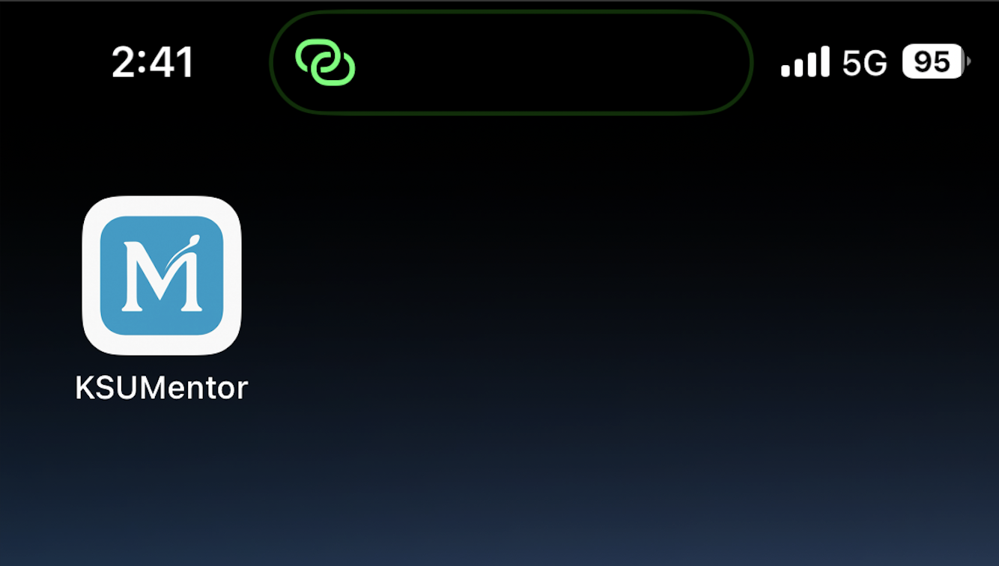
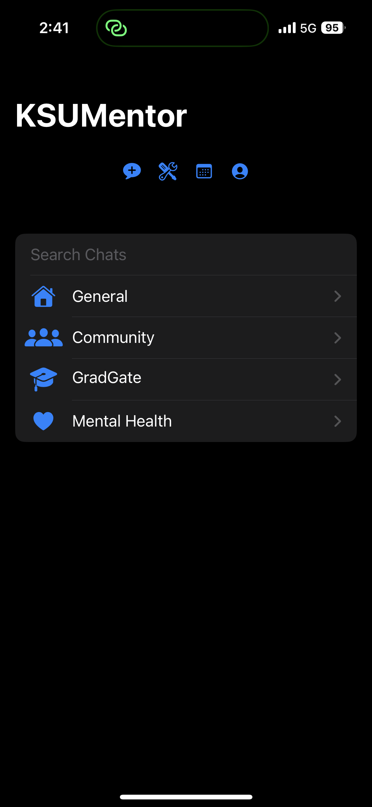
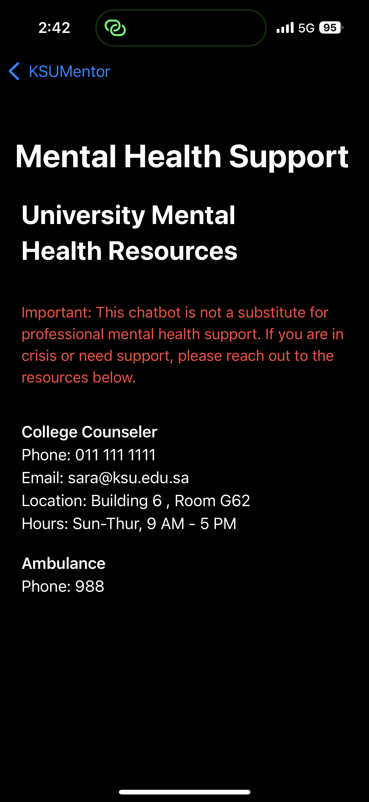
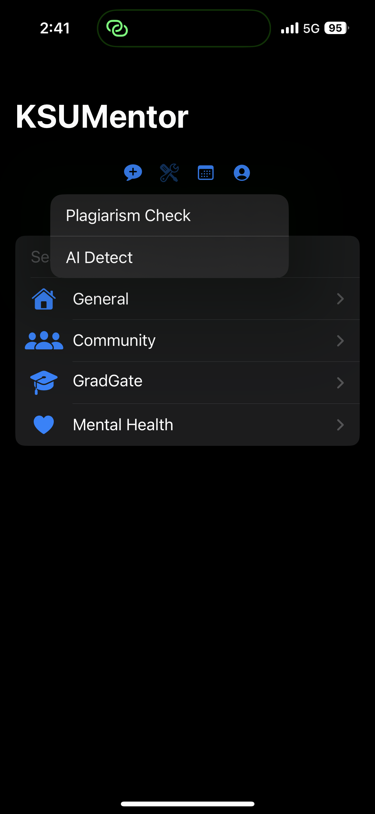
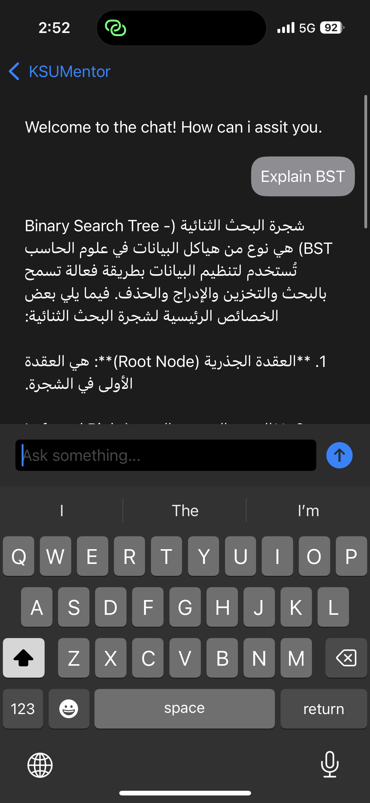

# 🎓 KSU Mentor – Academic AI Companion | المساعد الذكي لطلبة جامعة الملك سعود

KSU Mentor is a bilingual (Arabic–English) iOS application developed for the King Saud University Transformation Hackathon. It serves as an intelligent academic assistant that supports students in navigating their academic and career journey by integrating ChatGPT-powered AI services and personalized tools.

تطبيق "KSU Mentor" هو مساعد ذكي ثنائي اللغة (عربي–إنجليزي) تم تطويره ضمن هاكاثون التحوّل بجامعة الملك سعود، ويهدف إلى تمكين الطلبة أكاديميًا ومهنيًا من خلال دمج أدوات الذكاء الاصطناعي والدعم الشخصي.

---

## 🚀 Features | المميزات

- 🧑‍🏫 Smart Chat Assistant for students (General, Community, GradGate tabs)
- 📅 Academic Calendar Viewer + Club/Volunteer Info
- 🧾 CV Generator, Study Plan Explorer, PDF Support
- 🔐 Integrated tools for AI detection and plagiarism check
- 🧠 Mental Health Resources (Therapist info)
- 🌙 Supports Light and Dark Mode
- 💬 Fully bilingual (Arabic + English)

---
<h2>📱 App Screenshots</h2>

<table>
  <tr>
    <td align="center">
      <br/>
      <b>🏠 Home</b>
    </td>
    <td align="center">
      <br/>
      <b>🧑‍🎓 Chat Categories</b>
    </td>
  </tr>
  <tr>
    <td align="center">
      <br/>
      <b>📆 Calendar</b>
    </td>
    <td align="center">
      <br/>
      <b>🧠 Mental Health</b>
    </td>
  </tr>
  <tr>
    <td align="center">
      <br/>
      <b>🛠 Tools</b>
    </td>
    <td align="center">
      <br/>
      <b>👤 Profile</b>
    </td>
  </tr>
  <tr>
    <td align="center">
      <br/>
      <b>🦾 Example</b>
    </td>
    <td></td>
  </tr>
</table>

## 🛠 Project Structure | بنية المشروع

```plaintext
KSU_Mentor/
├── KSU Mentor.xcodeproj         # Project configuration
├── KSU Mentor/                  # Main Swift files (Views, Models)
├── Assets.xcassets/             # App icons & images
├── Info.plist                   # App settings
├── README.md                    # Project overview
```

---

## 🧪 How to Run | طريقة التشغيل

1. Clone or download the project
2. Open `KSU Mentor.xcodeproj` in Xcode
3. Run on simulator or real device
4. Replace `APIKey` with your actual OpenAI API key

1. حمّل المشروع وافتحه في Xcode  
2. شغّله على المحاكي أو جهاز حقيقي  
3. استبدل ملف `APIKey` بمفتاح API الخاص بك من OpenAI

---

## ⚠️ Excluded Files | الملفات المستثناة

- `APIKey` – OpenAI credentials  
- `student_info` – Sensitive data for testing  
- `Config.xcconfig` – Local build configurations  
- `.DS_Store`, `xcuserdata`, `build`, `DerivedData`

---

## 🏁 Submitted to

> 🖲️💡 **Transformation Hackathon – King Saud University**  
> 🔗  Track | Smart Student Experience Theme  
> 📅 2025

---

## 📄 License

This project is for academic and demonstration use only. Do not reuse any credentials or private data.

> ⚠️ This app is for demo purposes only. No real API key is included.
> To enable functionality, create your own OpenAI API key and add it manually to your local code.
